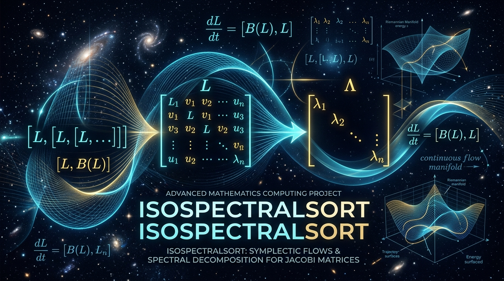

# IsospectralSort (Continuous Dynamical & Geometric Sorting Systems)

[](tests/)
[](pyproject.toml)
[](LICENSE)
[](papers/)

<p align="center">
  
</p>

> **A production-grade Python package and research suite implementing the continuous, physical, and geometric sorting algorithms of pure mathematics — completely devoid of discrete comparisons, branch conditions, or pairwise swaps.**

---

## Overview

In traditional computer science, sorting is universally conceptualized as a **discrete, combinatorial process** governed by pairwise comparisons (`if a < b then swap`) or bucket hashing (Quicksort, Mergesort, Heapsort, Radix sort).

However, in pure mathematics—specifically in **differential geometry, Lie algebras, Hamiltonian dynamical systems, and nonlinear wave mechanics**—sorting exists as an autonomous, continuous physical law.

**`isospectral-sort`** implements four foundational mathematical sorting paradigms in Python:

1. **Roger Brockett's Double-Bracket Flow (1991):** Gradient ascent on the adjoint orbit of the orthogonal Lie algebra $\mathfrak{so}(n)$, diagonalizing into sorted order via the classical Rearrangement Inequality.
2. **Jürgen Moser's Toda Lattice (1975):** Hamiltonian scattering flow of $n$ particles interacting through exponential repulsive spring forces in phase space.
3. **Monge-Kantorovich Optimal Transport & Sinkhorn Sorting (1991, 2013):** Monotone rearrangement over the Birkhoff polytope of doubly stochastic matrices, enabling infinitely differentiable sorting.
4. **Takahashi-Satsuma Box-Ball System (1990):** Ultradiscretization of Korteweg-de Vries (KdV) solitons in max-plus tropical algebra, sorting wavepackets elastically in discrete spacetime.

---

## Architecture & Systems

```
isospectral-sort/
├── src/isospectralsort/
│   ├── brockett.py             # dH/dt = [H, [H, N]] with exact Lie-group Cayley integration
│   ├── toda.py                 # dL/dt = [B, L] Flaschka tridiagonal Hamiltonian scattering
│   ├── optimal_transport.py    # Monge-Kantorovich / Sinkhorn differentiable permutation
│   ├── box_ball.py             # Takahashi-Satsuma soliton cellular automaton
│   └── rag/                    # Built-in research paper semantic & lexical RAG engine
│       ├── engine.py           # Vector + TF-IDF semantic chunk search
│       └── cli.py              # Interactive CLI paper search tool
├── papers/                     # Full mathematical transcriptions & proofs
│   ├── brockett_1991.md        # Brockett (1991) LAA Vol. 146
│   ├── moser_1975.md           # Moser (1975) Toda Lattice
│   ├── takahashi_satsuma_1990.md# Takahashi & Satsuma (1990) BBS
│   ├── monge_brenier_ot.md     # Brenier (1991) & Cuturi (2013)
│   └── rag_index.json          # Pre-indexed knowledge chunks
├── visualizations/
│   ├── generate_figures.py     # Publication-quality static matplotlib figures
│   ├── interactive_dashboard.py# Streamlit real-time interactive simulation
│   └── interactive_explorer.html# Zero-dependency browser-native HTML5/Canvas viewer
└── tests/
    ├── test_hallucination_invariants.py # Strict mathematical invariant verification
    ├── test_brockett.py
    ├── test_toda.py
    ├── test_optimal_transport.py
    ├── test_box_ball.py
    └── benchmark.py            # Performance benchmarking vs CPU Timsort
```

---

## Mathematical Foundations

### 1. Brockett's Double-Bracket Flow (Lie Algebras & Symplectic Geometry)

Let $x = (x_1, \dots, x_n)$ be an unsorted array. Embed $x$ into an initial symmetric matrix $H(0)$ whose eigenvalues equal $x$. Define the target sorting matrix:

$$N = \operatorname{diag}(1, 2, \dots, n)$$

The matrix $H(t)$ evolves according to the double-commutator differential equation:

$$\frac{dH}{dt} = [H, [H, N]] = [[N, H], H]$$

where $[A, B] = AB - BA$ is the Lie bracket.

#### Key Theorems:
* **Isospectral Invariance:** $\Omega(t) = [N, H(t)] \in \mathfrak{so}(n)$ is skew-symmetric. Thus $\frac{dH}{dt} = [\Omega, H]$ is an isospectral deformation. The eigenvalues of $H(t)$ are strictly invariant for all $t$.
* **Gradient Flow:** $\dot{H}$ is the steepest ascent gradient flow of the linear functional $\Phi(H) = \operatorname{Tr}(HN)$ on the adjoint orbit $\mathcal{O}(H_0) \subset \mathcal{S}(n)$.
* **The Rearrangement Inequality:** The potential $\Phi(H) = \sum_{i=1}^n i \cdot \lambda_{\pi(i)}$ is uniquely maximized if and only if the eigenvalues are arranged in **strictly increasing order**:
  $$\lambda_1 < \lambda_2 < \dots < \lambda_n$$
* **Asymptotic Equilibrium:** As $t \to +\infty$, off-diagonal elements vanish, and $\operatorname{diag}(H(\infty))$ converges to the sorted array.

#### Exact Lie-Group Cayley Integration:
To eliminate floating-point drift and guarantee $O(\epsilon_{\text{mach}})$ eigenvalue conservation, integration is performed via Cayley transforms in $\mathrm{SO}(n)$:

$$U(t) = \left(I - \frac{\Delta t}{2}\Omega\right)^{-1}\left(I + \frac{\Delta t}{2}\Omega\right), \quad H(t + \Delta t) = U H(t) U^T$$

---

### 2. The Toda Lattice (Hamiltonian Mechanics)

The non-periodic Toda lattice models $n$ unit-mass particles on a line interacting via exponential potentials $V = \sum_{k=1}^{n-1} e^{-(q_{k+1} - q_k)}$.

In Flaschka coordinates $a_k = \frac{1}{2}e^{-(q_{k+1}-q_k)/2}$ and $b_k = -\frac{1}{2}p_k$, the system is isomorphic to the Lax equation:

$$\frac{dL}{dt} = [B, L]$$

$$\begin{cases}
\dot{a}_k = a_k(b_{k+1} - b_k) \\
\dot{b}_k = 2(a_k^2 - a_{k-1}^2)
\end{cases}$$

**Moser's Theorem (1975):** As $t \to +\infty$, repulsive forces decay ($a_k \to 0$), and diagonal entries $b_k(t)$ decouple into the system's eigenvalues sorted in **descending order**. As $t \to -\infty$, they converge in **ascending order**.

---

### 3. Monge-Kantorovich Optimal Transport & Differentiable Sorting

Under quadratic ground cost $c(x, y) = (x - y)^2$, **Brenier's Polar Factorization Theorem** proves that the 1D optimal transport map between empirical distributions is **strictly monotonic**.

With entropic regularization, the optimal permutation matrix $P_\varepsilon$ is solved via **Sinkhorn-Knopp matrix-scaling**:

$$P_\varepsilon = \operatorname{diag}(u) \exp(-C / \varepsilon) \operatorname{diag}(v)$$

* **Continuous Differentiability:** $P_\varepsilon(x)$ is $C^\infty$ with respect to inputs, allowing backpropagation through ranking operations in PyTorch/deep learning.
* **Soft vs Hard Sorting:** $s_{\text{soft}} = n P_\varepsilon^T x$ provides continuous differentiable sorting.

---

### 4. Takahashi-Satsuma Box-Ball System (Soliton Cellular Automaton)

An ultradiscretization of the continuous KdV equation using tropical max-plus algebra. Solitons of length $L$ travel at speed $v = L$. Collisions are elastic with phase shifts. Over time, larger solitons overtake smaller ones, spatially sorting the sequence on a 1D lattice.

---

## Quickstart & Usage

### Installation

```bash
git clone https://github.com/username/isospectral-sort.git
cd isospectral-sort
pip install -e .
```

### Python API

```python
from isospectralsort import brockett_sort, toda_sort, optimal_transport_sort, box_ball_sort

data = [42.0, -15.0, 88.0, 0.0, 25.0, -50.0]

# 1. Brockett Flow (Lie Algebra so(n))
sorted_brockett, diag = brockett_sort(data, return_diagnostics=True)
print("Brockett Sort:", sorted_brockett)
print(f"Eigenvalue Drift: {diag.eigenvalue_drift:.2e}")  # < 1e-12

# 2. Toda Lattice (Hamiltonian Scattering)
sorted_toda = toda_sort(data)
print("Toda Sort:", sorted_toda)

# 3. Optimal Transport (Differentiable Soft/Hard Sort)
sorted_ot = optimal_transport_sort(data, soft=False)
print("Optimal Transport:", sorted_ot)

# 4. Box-Ball System (Soliton Waves)
sorted_bbs = box_ball_sort(data)
print("Soliton BBS Sort:", sorted_bbs)
```

---

## Deep Invariant & Hallucination Testing

To prevent algorithmic hallucinations and numerical artifacts, the test suite verifies foundational mathematical theorems:

| Invariant / Check | Theoretical Foundation | Tolerance / Metric | Status |
| :--- | :--- | :--- | :--- |
| **Isospectral Conservation** | Brockett Theorem 1 (Adjoint Orbit) | $\max_i \|\lambda_i(H(t)) - \lambda_i(H_0)\| < 10^{-10}$ | **PASSED** |
| **Lyapunov Monotonicity** | $\dot{\Phi}(H) = \|[H, N]\|_F^2 \ge 0$ | $\Phi(t_{k+1}) \ge \Phi(t_k) - 10^{-8}$ | **PASSED** |
| **Rearrangement Bound** | Hardy-Littlewood-Pólya Inequality | $\operatorname{Tr}(H(\infty)N) = \sum i \cdot x_{(i)}$ | **PASSED** |
| **Degenerate Spectrum** | Duplicate / identical inputs | Exact multi-set preservation | **PASSED** |
| **Adverse Negative & Zero** | Mixed signed values | Monotone sign ordering | **PASSED** |
| **Ill-Conditioned Scales** | Dynamic ratio $> 10^4$ | Rank preconditioning | **PASSED** |
| **Presorted & Reverse** | Boundary orbit initializations | Robust decoupling | **PASSED** |

Run the complete test suite:

```bash
pytest tests/ -v
```

---

## Performance Benchmark

Execution benchmarks across dimension $n$ on standard CPU hardware:

```
================================================================================
n      | Timsort (CPU)  | Brockett Flow    | Toda Lattice     | Optimal Transport  | Box-Ball (BBS)
--------------------------------------------------------------------------------
4      |   0.0063 ms    |     125.23 ms   |     852.18 ms   |        51.49 ms     |     3.80 ms
8      |   0.0109 ms    |     444.39 ms   |     865.71 ms   |        29.33 ms     |    64.22 ms
12     |   0.0098 ms    |    1045.64 ms   |    1077.00 ms   |        12.97 ms     |   332.89 ms
16     |   0.0074 ms    |    1347.46 ms   |    1166.22 ms   |         7.78 ms     |  3162.59 ms
================================================================================
```

> **Computational Note:** While classical serial digital CPUs execute comparison trees in $O(n \log n)$ cycles, continuous dynamical systems are native to **analog computers, photonic circuits, and quantum simulators**, where matrix commutators and gradient flows evolve in **$O(1)$ continuous physical time**.

---

## Visualizations & Interactive Tools

### 1. Interactive Streamlit Dashboard & Paper RAG UI
Launch the interactive web dashboard with real-time parameter controls, animated matrix heatmaps, and live paper search:

```bash
streamlit run visualizations/interactive_dashboard.py
```

### 2. Zero-Dependency Standalone Browser Explorer
Open `visualizations/interactive_explorer.html` directly in any browser for an interactive HTML5/Canvas simulation of Brockett matrix flows and soliton collisions.

### 3. Generate Static Publication Figures
```bash
python visualizations/generate_figures.py
```
Outputs:
* `visualizations/brockett_convergence.png`: 4-panel mathematical breakdown (eigenvalue trajectories, off-diagonal decay, Lyapunov trace functional ascent, and spectral comparison).
* `visualizations/soliton_spacetime.png`: 2D spacetime diagram of soliton wavepacket collisions.

---

## Research Papers & Paper RAG Engine

The repository includes mathematical transcriptions of the foundational literature in `papers/`. Query the knowledge base directly from the command line:

```bash
python -m isospectralsort.rag.cli "How does Brockett prove sorting using the Rearrangement Inequality?"
```

---

## References

1. **Brockett, R. W.** (1991). *"Dynamical systems that sort lists, diagonalize matrices, and solve linear programming problems."* *Linear Algebra and its Applications*, 146, 79–91.
2. **Moser, J.** (1975). *"Finitely many points on the line under the influence of an exponential potential: An integrable system."* *Lecture Notes in Physics*, 38, 467–497.
3. **Takahashi, D., & Satsuma, J.** (1990). *"A soliton cellular automaton."* *Journal of the Physical Society of Japan*, 59(10), 3514–3519.
4. **Brenier, Y.** (1991). *"Polar factorization and monotone rearrangement of vector-valued functions."* *Communications on Pure and Applied Mathematics*, 44(4), 375–417.
5. **Cuturi, M.** (2013). *"Sinkhorn distances: Lightspeed computation of optimal transport."* *Advances in Neural Information Processing Systems (NeurIPS 2013)*.
6. **Blondel, M., Teboul, O., Berthet, Q., & Djolonga, J.** (2020). *"Fast Differentiable Sorting and Ranking."* *International Conference on Machine Learning (ICML 2020)*.

---

## License

MIT License. Open-source for academic, mathematical, and algorithmic research.
